# アプリケーション名
 Sunny
 
# アプリケーション概要

- このアプリケーションは登録無料で誰でも有名人とチャットができます。
- お気に入りの有名人に対して投げ銭をすることができます。

# URL

 https://myapp20210213.herokuapp.com/
 
# テスト用アカウント
 ゲストログイン機能がありますので、テスト用のアカウントは用意していません。
 
# 利用方法
## 一般ユーザーの利用方法
画面右上の新規登録ボタンから新規登録をします。
新規登録を行ったあとはトップ画面下の有名人一覧画面から気になる有名人の名前をクリックします。
有名人と自分と二人だけのチャットルームに画面が遷移します。
チャット画面の下にあるフォームにメッセージを入力します。
送信ボタンをクリックすることで相手にメッセージを送ることができます。
自分の送信したメッセージは画面右側に相手から送信されたメッセージは画面左側に表示されます。
メッセージを削除したい場合は送信したメッセージをクリックすると削除ボタンがポップアップするので、削除をクリックします。
気に入った有名人に対しては有名人の名前の隣にある星をクリックすることでお気に入り登録できます。もう一度クリックすると、お気に入りを解除できます。
有名人を検索したいときには画面右側にある有名人一覧表示をクリックします。出現した検索フォームに検索を入力します。画面は一度画面がリロードされますが、もう一度有名人検索一覧表示をクリックすることで検索結果が表示されます。
有名人検索表示一覧に表示されている有名人の名前をクリックすることでその有名人とのチャット画面に遷移することができます。
メッセージ入力フォームの左側にあるボタン(投げ銭ボタン)をクリックすると投げ銭のための金額が表示されます。表示された金額をクリックするとクレジットカード情報登録画面に遷移します。こちらのクレジットカード情報の登録はログイン後にトップ画面に出現する、マイページというリンクをクリックすることで登録することも可能です。クレジットカードの登録が終了し、もう一度投げ銭ボタンの金額をクリックすると相手に投げ銭をすることができます。投げ銭が完了すると、自動で相手に投げ銭したことを伝えるメッセージを送信します。
マイページの
メッセージ入力フォームの左側にあるボタン(投げ銭ボタン)をクリックすると投げ銭のための金額が表示されます。表示された金額をクリックするとクレジットカード情報登録画面に遷移します。こちらのクレジットカード情報の登録はログイン後にトップ画面に出現する、マイページというリンクをクリックすることで登録することも可能です。クレジットカードの登録が終了し、もう一度投げ銭ボタンの金額をクリックすると相手に投げ銭をすることができます。投げ銭が完了すると、自動で相手に投げ銭したことを伝えるメッセージを送信します。
マイページへは、ログイン後に常時画面右上に表示されるマイページのボタンをクリックすることで、遷移することができます。マイページには、登録したクレジットカード登録情報、新着メッセージ、トーク履歴、お気に入り登録した有名人の一覧が表示されています。それぞれの有名人の名前をクリックするとその有名人とのチャットルームに遷移することができます。

## アプリ管理者のアプリ利用方法
管理者はトップ画面右上のユーザー専用のログインボタンをクリックし、管理者でログインすることで管理者専用画面に遷移することができます。
管理者は管理者画面からあらかじめ有名人をデータベースに登録します。

## 有名人のアプリ利用方法
有名人は管理者があらかじめ登録した情報を用いてトップ画面左上に表示されている有名人専用のログインボタンをクリックし、ログイン画面に遷移する。登録された情報を入力し、ログインします。
有名人はログインすると、トップ画面左上にマイページへのリンクが表示される。マイページへのリンクをクリックすると、マイページに遷移します。マイページには、投げ銭で受け取ったお金の合計、新着メッセージ、トーク履歴、ブロックしているユーザーの名前が表示される。
新着メッセージ、トーク履歴に表示してあるユーザーの名前をクリックすることで、そのユーザーとのチャット画面に遷移することができる
メッセージの送信方法、削除方法、メッセージの表示のされ方は一般ユーザーと同じです。
チャット画面の一般ユーザーの名前の隣にあるブロックボタンをクリックすることで、その相手からの新着メッセージは非表示になります。ブロックした後でもメッセージを送信することはできます。
ブロックを解除するにはマイペーにあるブロックユーザーの名前の隣にあるブロックを解除するをクリックしてください。

## 一般ユーザーと有名人に共通するアプリ利用方法
何かアプリをしようしていて困ったことがあれば、トップ画面の左上に表示されているお問い合わせボタンをクリックしてください。
お問い合わせボタンをクリックすると、お問い合わせフォーム入力画面に遷移します。あらかじめログイン中のユーザーの名前とemailが入力されています。（変更可能です）お問い合わせ内容はemailの下にある入力フォームに入力して下さい。
確認ボタンを押すと、入力内容を確認する画面に遷移します。確認ができたら、送信ボタンをクリックすると、お問い合わせが管理人のメールアドレスに対して送信されます。
送信ボタンがクリックされると、別画面に遷移します。その画面からは5秒後に自動的にトップ画面に遷移します。

# 目指した課題解決
このアプリを作るきっかけは、一般人と芸能人や世間になの売れている人とをつなげるアプリケーションがあれば、有名人とチャットをしたい一般人と、自分のファンにサービスをしたい有名人をつなげることができると面白いのではないかと考えたからです。また、この有名人とは誰もが認知している有名人だけでなく、まだ駆け出しで、世間には認知されていない芸能活動をしている方も当てはまります。まだ駆け出しの方はファンを増やすことができます。一方ファンの方は応援したい有名人に対して、投げ銭という形で応援することができます。
有名人と一般人がもっと気軽にチャットすることができるようになればお互いにとって良い効果が生まれるのではないかと考えています。
また、一般人にとって大好きな有名人から自分だけにメッセージがきたらさぞ嬉しいことでしょう！

# 洗い出した要件
### トップページ
[ボタン] 
- 一般ユーザーの新規登録/ログインページに遷移できるボタンがある
- 有名人のログインページに遷移できるボタンがある
- 有名人と一般ユーザーそれぞれのゲストログインができるボタンがある
- ログイン時は、ログアウトできるボタンがある
- ログイン時は、マイページに遷移できるボタンがある
- ログイン時は、お問い合わせ画面に遷移できるボタンがある
- 一般ユーザーのログイン時は、有名人一覧の有名人の名前が有名人とのチャットルームへのボタンになる

[表示] 
- 登録されている有名人の一覧を見ることができる
- 有名人の人気ランキングを見ることができる
- 簡単なアプリの説明を見ることができる

## 一般ユーザーのサインイン/ログインページ
[ボタン] 
- Facebook/Googleアカウントを用いてのサインイン、ログイン認証に遷移するボタンがある
- プロフィール画像を選択に遷移するボタンがある
- 会員登録、ログインボタンがある
- アプリのロゴがトップページに戻るボタンになっている

[記入欄] 
- ニックネーム、メールアドレス、パスワード、パスワード(確認)、お名前(全角)、お名前カナ(全角)、生年月日の記入欄がある

## 有名人のログインページ
[ボタン] 
- ログインボタンがある
- アプリのロゴがトップページに戻るボタンになっている

[記入欄] 
- メールアドレス、パスワードの記入欄がある

## お問い合わせ/お問い合わせ内容確認/お問い合わせありがとうページ
[ボタン] 
- 確認、送信ボタンがある

[記入欄] 
- Name,Email,Messageの記入欄がある

[表示] 
- お問い合わせありがとうメッセージがある

## 一般ユーザーのマイページ
[ボタン] 
- 有名人の名前がその有名人とのチャットルームに遷移するボタンになっている
- ログアウトするボタンがある

[表示] 
- お気に入りに登録した有名人が表示されている
- 有名人とのトーク履歴が表示されている
- 有名人からの新着メッセージが表示されている
- ユーザーの名前、プロフィール画像、登録したクレジットカード情報が表示されている

## 有名人のマイページ
[ボタン] 
- 一般ユーザーの名前がそのユーザーとのチャットルームに遷移するボタンになっている
- ログアウトするボタンがある

[表示] 
- ブロックした一般ユーザーが表示されている
- 一般ユーザーとのトーク履歴が表示されている
- 一般ユーザーからの新着メッセージが表示されている
- ユーザーの名前、プロフィール画像、もらったお金の合計が表示されている

## 一般ユーザーのチャットページ
[ボタン] 
- チャット相手の有名人をお気に入り登録するボタンがある
- マイページに遷移するボタンがある
- ログアウトするボタンがある
- 有名人一覧表示を表示するボタンがある
- 有名人を検索するボタンがある
- 有名人の名前が有名人とのチャット画面に遷移するボタンになっている
- 送信したMessageをクリックすると現れるボタンはメッセージ削除ボタンになっている
- メッセージ送信ボタンがある
- メッセージ記入欄の隣にあるアイコンをクリックすると出現する金額は投げ銭ボタンになっている

[記入欄] 
- 有名人キーワード検索の記入欄がある
- メッセージ記入欄がある

[表示] 
- 有名人のプロフィールが表示されている
- 有名人の一覧が表示されている
- 送信したメッセージが表示されている
- チャット相手からのメッセージが表示されている
- メッセージを送信した時刻、相手がそのメッセージを既読したかが表示されている

## 有名人のチャットページ
[ボタン] 
- チャット相手の一般ユーザーをブロックするボタンがある
- マイページに遷移するボタンがある
- ログアウトするボタンがある
- 送信したMessageをクリックすると現れるボタンはメッセージ削除ボタンになっている
- メッセージ送信ボタンがある

[記入欄] 
- メッセージ記入欄がある

[表示] 
- 送信したメッセージが表示されている
- チャット相手からのメッセージが表示されている
- メッセージを送信した時刻、相手がそのメッセージを既読したかが表示されている

# 実装した機能についてのGIFと説明
## 一般ユーザーの新規登録機能
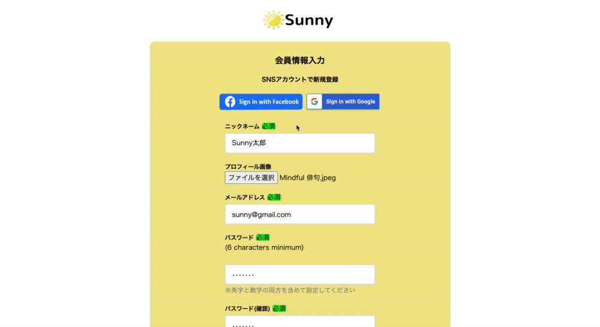

## 一般ユーザーのログイン/ログアウト機能

## 一般ユーザーのSNSアカウントを用いてのログイン機能
Facebookアカウントでまだログインしたことがなかった場合 
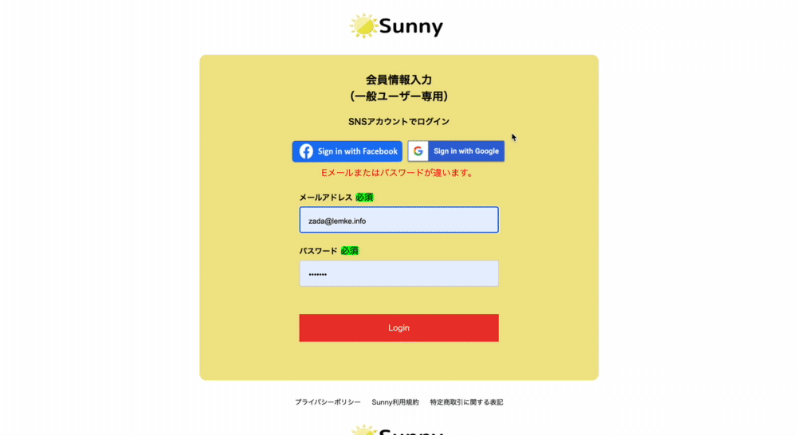
Facebookアカウントですでにログインしたことがあった場合 

Googleアカウントでまだログインしたことがなかった場合 
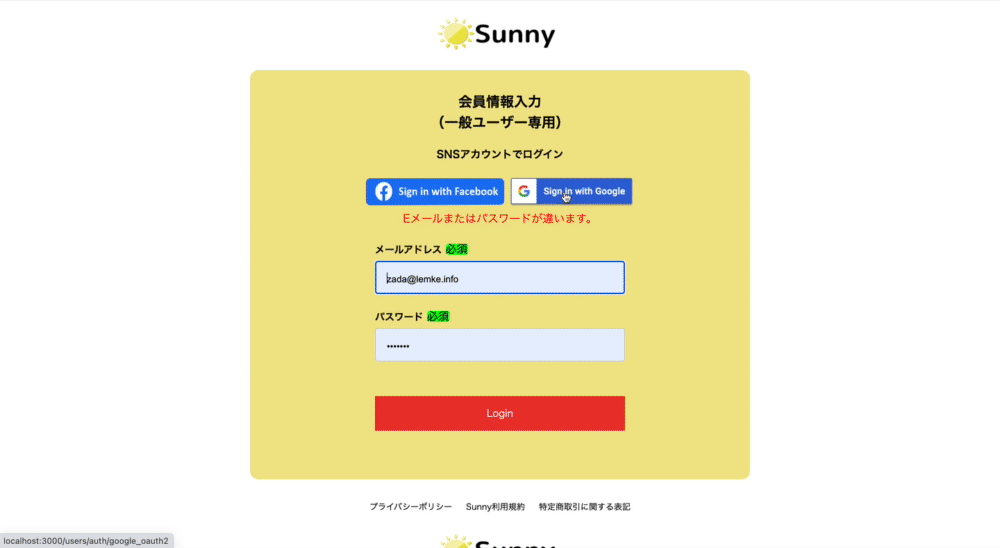
Googleアカウントですでにログインしたことがあった場合 
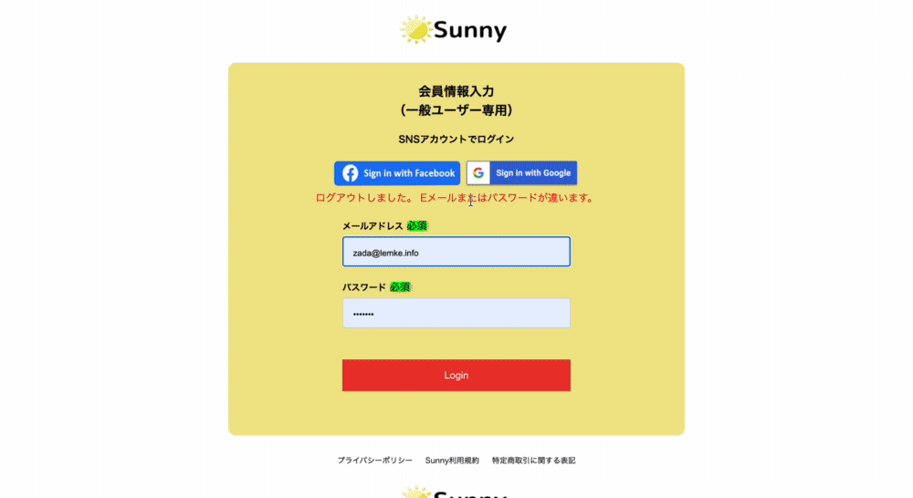

## 有名人のログイン/ログアウト機能
有名人のログイン機能 
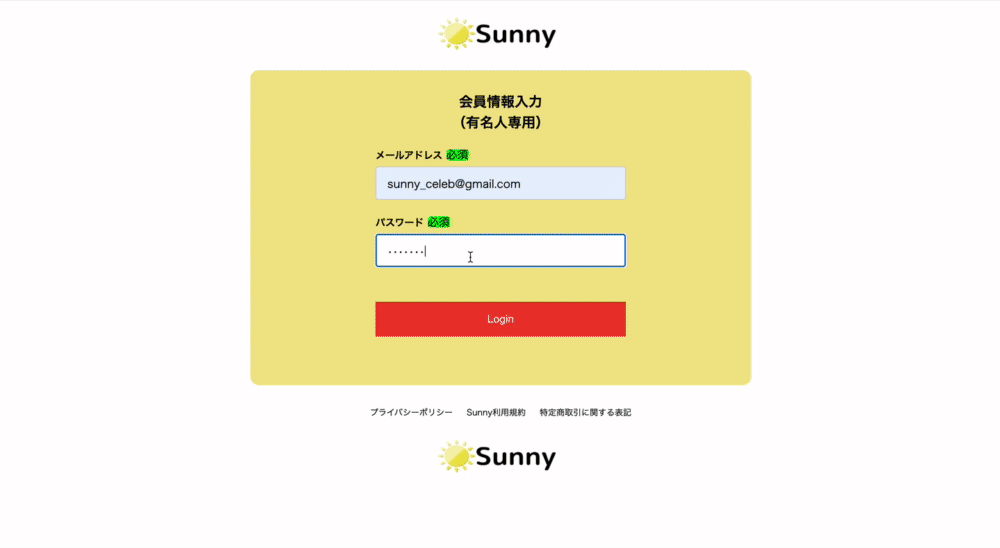
有名人のログアウト機能 
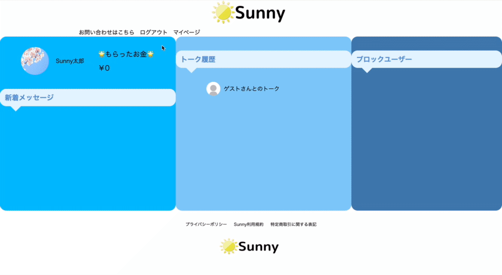

## 管理者のログイン/ログアウト機能

## トップページの有名人一覧のページネーション機能

## 一般ユーザーのゲストログイン機能

## 有名人のゲストログイン機能

## カード情報の登録
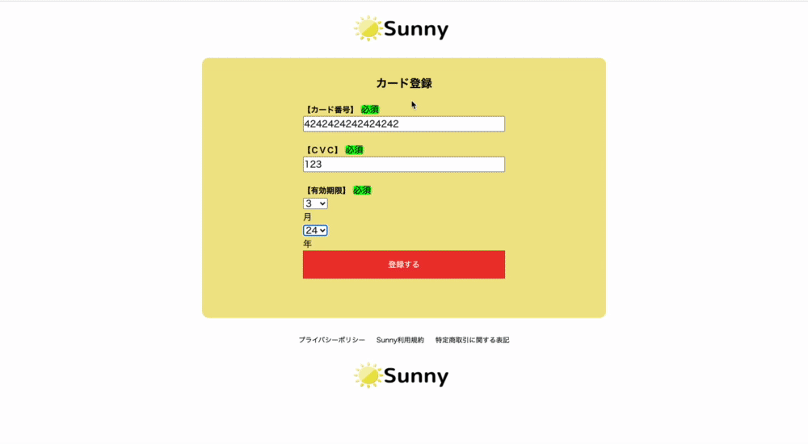

## メッセージの送信機能
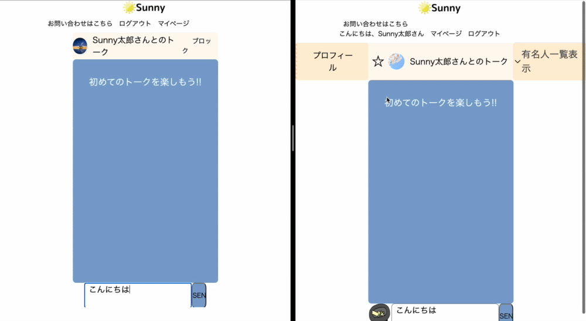

## メッセージの削除機能
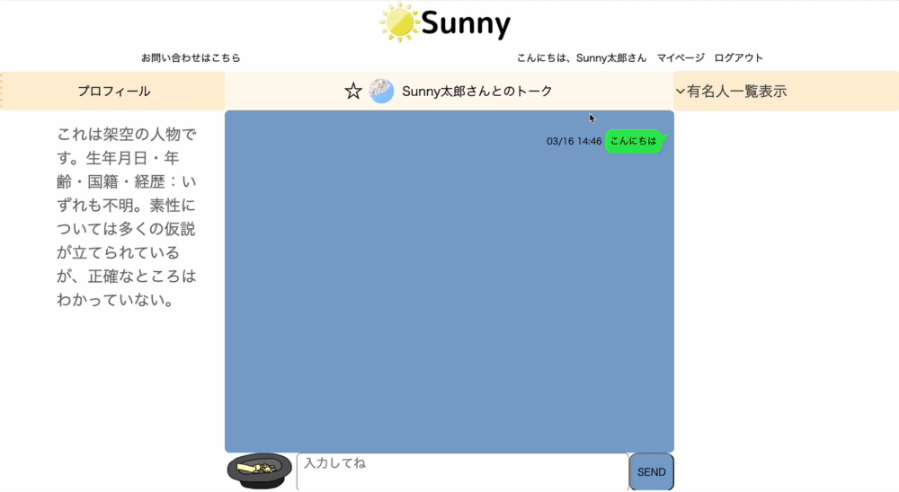

## 有名人の検索機能
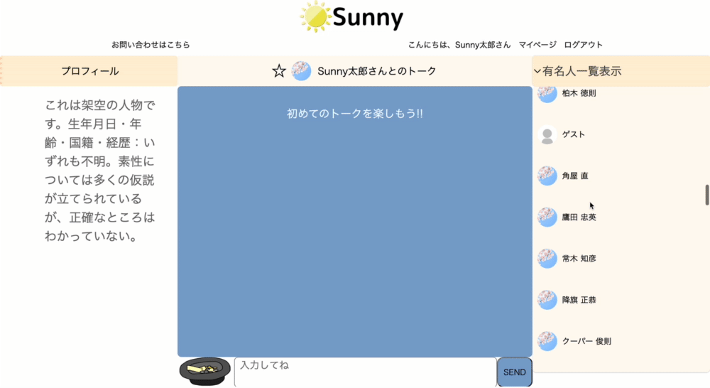

## 一般ユーザーの新着メッセージ
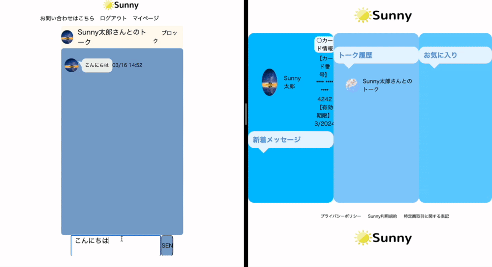

## お気に入り登録機能
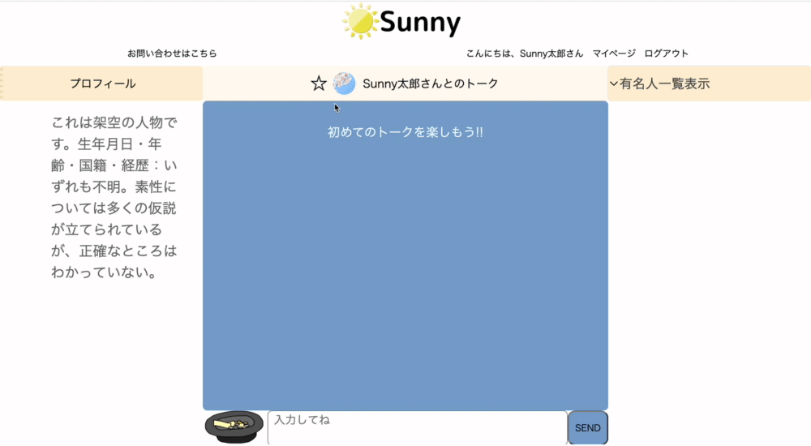

## 有名人の新着メッセージ
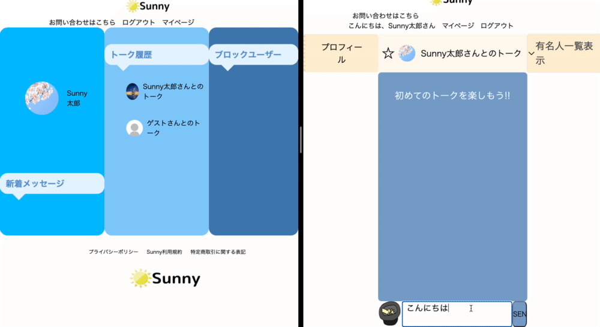

## ブロックユーザー機能
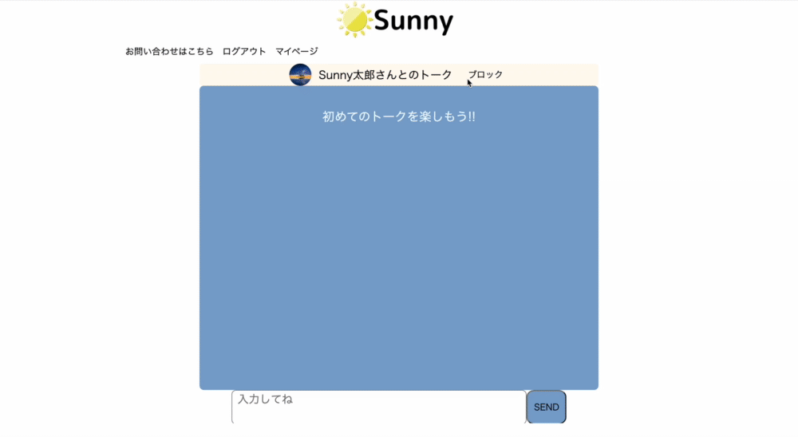

## メッセージの既読機能

## 投げ銭機能
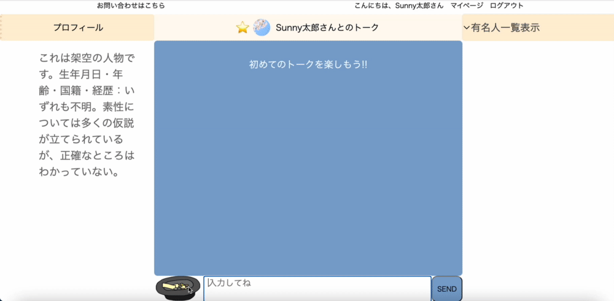

## ランキング機能

## お問い合わせ機能
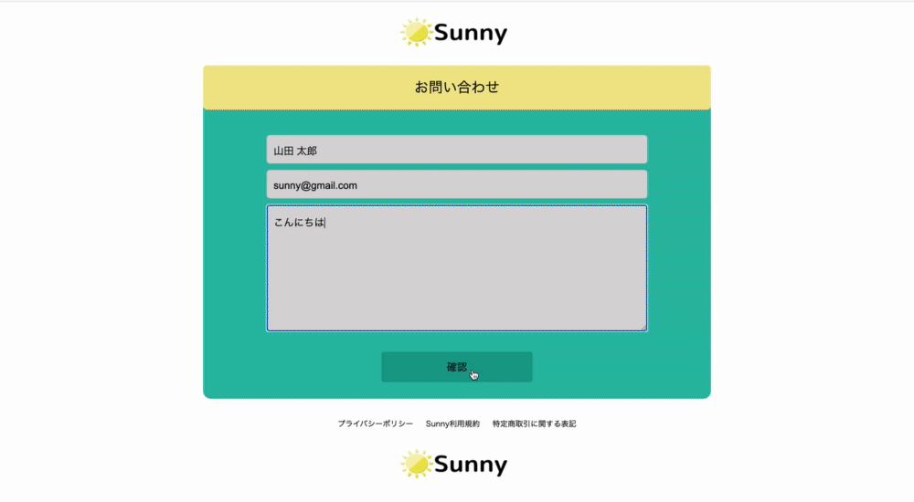
管理者のメール受信 

# 実装予定の機能

# データベース設計

## users テーブル

| Column               | Type         | Options     |
| ------               | ------       | ----------- |
| nickname             | string       | null: false |
| email                | string       | null: false, unique: true |
| encrypted_password   | string       | null: false |
| first_name           | string       | null: false |
| last_name            | string       | null: false |
| first_name_katakana  | string       | null: false |
| last_name_katakana   | string       | null: false |
| birthday             | date         | null: false |
| admin                | boolean      |

### Association

- has_many :rooms
- has_many :messages
- has_many :likes
- has_many :sns_credentials

## celebs テーブル

| Column          | Type   | Options     |
| ------          | ------ | ----------- |
| name            | string | null: false |
| email           | string | null: false,unique: true  |
| password_digest | string | null: false |
| description     | text   | null: false |

### Association

- has_many :rooms
- has_many :messages
 

## rooms テーブル

| Column   | Type       | Options                        |
| ------   | ---------- | ------------------------------ |
| user     | references | null: false, foreign_key: true |
| celeb    | references | null: false, foreign_key: true |

### Association

- belongs_to :user
- belongs_to :celeb
- has_many :messages
- has_one  :block
- has_many :orders
- has_one  :room
- has_one  :like

## messages テーブル

| Column  | Type       | Options                        |
| ------- | ---------- | ------------------------------ |
| content | text       | null: false                    |
| user    | references | foreign_key: true              |
| celeb   | references | foreign_key: true              |
| room    | references | null: false, foreign_key: true |
| read    | boolean    | null: false                    |
| order   | boolean    | null: false                    |

### Association

- belongs_to :user
- belongs_to :room
- belongs_to :celeb

## blocks テーブル

| Column  | Type       | Options                        |
| ------- | ---------- | ------------------------------ |
| room    | references | foreign_key: true              |

### Association

- belongs_to :room

## prices テーブル

| Column    | Type       | Options                        |
| -------   | ---------- | ------------------------------ |
| content   |  string    | null: false                    |

### Association

- has_many :orders

## orders テーブル

| Column   | Type       | Options                        |
| ------   | ---------- | ------------------------------ |
| price    | references | null: false, foreign_key: true |
| room     | references | null: false, foreign_key: true |

### Association

- belongs_to :price
- belongs_to :room

## likes テーブル

| Column   | Type       | Options                        |
| ------   | ---------- | ------------------------------ |
| room     | references | null: false, foreign_key: true |
| user     | references | null: false, foreign_key: true |

### Association

- belongs_to :user
- belongs_to :room

## sns_credentials

| Column   | Type       | Options                        |
| ------   | ---------- | ------------------------------ |
| provider | string     | null: false                    |
| uid      | string     | null: false                    |
| user     | references | null: false, foreign_key: true |

### Association

- belongs_to :user

# ローカルでの動作方法
## 動作確認前に実行するコマンド
- コマンドでbundle installを実行し、gemのインストール
- yarn intallでパッケージをインストール
- データベースの作成のため rails db:migrate
- データベースにデータを作成するために rails db:seed
- rails sでサーバーの立ち上げ

## パッケージ、開発に使用した言語のバージョン
Ruby[2.6.5]
Ruby on rails [6.0.0]
@rails/actioncable[6.0.0-alpha]
@rails/activestorage [6.0.0-alpha]
@rails/ujs [6.0.0-alpha]
@rails/webpacker [4.3.0]
core-js [3.9.1]
ev-emitter [2.1.0]
fizzy-ui-utils [3.0.0]
infinite-scroll [4.0.1]
jquery [3.6.0]
turbolinks [5.2.0]
